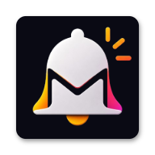

<div align="center">



# NotifIQ

**Intelligent Notification Management for Android**

[](https://developer.android.com)
[](https://kotlinlang.org)
[](LICENSE)
[](https://notifiq.app/privacy)

*Every notification, classified. Nothing important missed. Everything noisy silenced.*

</div>

---

## What is NotifIQ?

NotifIQ is a native Android app that listens to your notifications, scores each one using a local on-device intelligence engine, and surfaces only what actually matters — while quietly filing away the noise.

No cloud. No servers. No tracking. Everything runs entirely on your device.

---

## Features

| | |
|---|---|
| 🧠 **Smart Classification** | Scores every notification as Important, Useful, Normal, Low Value, or Spam using 6 weighted scorers |
| 🔕 **Suppression Mode** | Silently removes low-value notifications from your shade — OTPs, banking, and calls are always protected |
| 📥 **Private Inbox** | Every notification is captured and stored locally, nothing is ever lost |
| 📊 **Analytics** | Daily and weekly intelligence reports showing your notification patterns |
| 🎓 **Learns From You** | Feedback you give trains the classifier over time |
| ⏰ **Quiet Hours** | Automatically silence non-critical notifications during sleep hours |
| 🛡️ **Privacy First** | Zero network requests, zero telemetry, zero ads |

---

## Architecture

NotifIQ is built with a strict multi-module Clean Architecture:

```
app/                    → Navigation, DI wiring, Application class
core/
  ├── core-model        → Pure Kotlin domain models
  ├── core-database     → Room database, DAOs, entities
  ├── core-datastore    → DataStore preferences
  ├── core-designsystem → Compose theme, shared components
  └── core-common       → Utilities (hashing, date, constants)
classification/         → 6-scorer classification engine + PolicyEngine
capture/                → NotificationListenerService + normalizer
feature/                → 9 feature modules (inbox, home, analytics…)
worker/                 → 5 WorkManager background tasks
```

**Stack:** Kotlin · Jetpack Compose · Hilt · Room · DataStore · WorkManager · Paging 3 · Coroutines + Flow

---

## Classification Engine

Each notification is scored from `0.0 → 1.0` by six independent scorers running in priority order:

```
UserFeedbackScorer  →  learns from your explicit feedback
KeywordScorer       →  OTP, banking, promo keyword detection
AppReputationScorer →  per-package trust (WhatsApp ↑, Flipkart ↓)
ChannelImportanceScorer → Android channel priority signals
FrequencyScorer     →  penalises spammy high-volume apps
TimeContextScorer   →  mild late-night penalty
```

The **SafetyGuard** runs before every suppression decision and permanently protects OTPs, banking alerts, calls, alarms, and high-importance notifications — they can never be silenced.

---

## Getting Started

### Prerequisites

- Android Studio Hedgehog or newer
- Android SDK 26+ (Android 8.0)
- JDK 17

### Build

```bash
git clone https://github.com/yourusername/NotifIQ.git
cd NotifIQ
./gradlew installDebug
```

### Grant Notification Access

After installing, open **Settings → Notification Access → NotifIQ → Allow**.

---

## Privacy

NotifIQ reads notification content **only on your device**.

- ❌ No data uploaded to any server
- ❌ No analytics SDKs
- ❌ No advertising networks
- ✅ All storage is local SQLite (auto-deleted after your chosen retention period)
- ✅ Export or delete all your data at any time from Settings

[Read the full privacy policy →](app/src/main/assets/privacy_policy.html)

---

## Contributing

Pull requests are welcome. For major changes, please open an issue first to discuss what you'd like to change.

---

## License

MIT © 2024 NotifIQ

---

<div align="center">

*Built locally. No data ever leaves your device.*

</div>